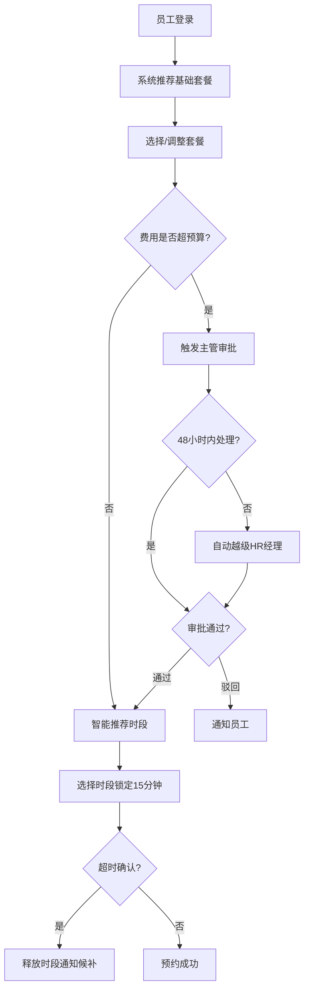

## 1. 产品概述

企业员工健康体检预约与报告管理平台，整合体检预约、报告流转、费用审批与统计分析全链路。为企业提供数字化体检管理解决方案，提升体检组织效率，优化员工体检体验。

- **核心价值**：实现体检全流程数字化，智能推荐优化资源配置，多级审批确保费用合规
- **目标用户**：企业员工、体检医生、HR管理员、系统管理员

## 2. 核心功能

### 2.1 用户角色

| 角色 | 注册方式 | 核心权限 |
|------|---------|---------|
| 员工 | 企业账号集成 | 预约体检、查看报告、选择套餐项目 |
| 医生 | 管理员分配 | 录入体检报告、标记异常指标、提交复检建议 |
| HR | 管理员分配 | 查看部门统计、导出报表、处理审批、管理未检人员 |
| 管理员 | 系统初始 | 套餐管理、规则配置、审批阈值设置、用户权限管理 |

### 2.2 功能模块

1. **登录页**：角色选择、身份验证、权限路由
2. **首页大屏**：实时数据展示、多维筛选、统计图表
3. **体检预约**：套餐选择、智能时段推荐、锁定与释放机制
4. **报告管理**：报告录入、自动校验、推送通知、复检流程
5. **费用审批**：预算校验、两级审批、自动越级、审批历史
6. **HR统计**：完成率分析、未检人员、月度报表导出
7. **管理员中心**：套餐配置、规则管理、审批阈值、用户管理

### 2.3 页面详情

| 页面名称 | 模块名称 | 功能描述 |
|---------|---------|---------|
| 登录页 | 身份认证 | 账号密码登录、角色自动识别、权限路由跳转 |
| 首页大屏 | 数据概览 | 今日预约人数、完成率、异常报告数、费用执行进度，10秒自动刷新 |
| 首页大屏 | 筛选面板 | 按部门、套餐、日期多维筛选数据 |
| 体检预约 | 套餐列表 | 基础套餐推荐（按年龄性别）、套餐详情、项目增减 |
| 体检预约 | 时段选择 | 智能推荐可选时段（容量+排班）、15分钟锁定、超时自动释放 |
| 体检预约 | 候补机制 | 满员时加入候补、释放时自动通知候补人员 |
| 报告管理 | 医生录入 | 在线录入报告、必填项校验、异常指标标记 |
| 报告管理 | 报告查看 | 员工端报告展示、异常指标高亮、复检通知 |
| 费用审批 | 预算校验 | 套餐费用与部门预算对比、超支预警 |
| 费用审批 | 审批流程 | 主管→HR经理两级审批、48小时未处理自动越级 |
| HR统计 | 数据看板 | 部门完成率、未检人员名单、趋势图表 |
| HR统计 | 报表导出 | 一键导出月度体检统计表（Excel） |
| 管理员中心 | 套餐管理 | 套餐增删改、项目配置、价格设置 |
| 管理员中心 | 规则配置 | 预约锁定时长、审批阈值、预算周期设置 |

## 3. 核心流程

### 3.1 预约流程
员工登录→系统推荐基础套餐（年龄性别匹配）→员工选择/调整套餐→系统校验费用额度→智能推荐可选时段（体检中心容量+医生排班）→选择时段并锁定15分钟→确认预约→费用自动审批（超预算触发审批）→预约成功。超时未确认自动释放并通知候补。

### 3.2 报告流程
体检完成→医生在线录入报告→系统自动校验必填项和异常指标→合格报告推送员工端→不合格触发复检通知→员工预约复检。

### 3.3 审批流程
套餐费用超部门预算→自动触发主管审批→48小时未处理自动越级至HR经理→审批通过/驳回→员工收到通知。

## 4. 用户界面设计

### 4.1 设计风格

**设计方向**：专业医疗科技感，融合现代企业管理风格

- **主色调**：#0EA5E9（天空蓝）- 代表健康与科技
- **辅助色**：#10B981（翡翠绿）- 代表正常/通过；#F59E0B（琥珀黄）- 代表预警/待处理；#EF4444（珊瑚红）- 代表异常/未通过
- **中性色**：#0F172A（深蓝灰）作为主要文字，#F8FAFC（浅灰白）作为背景
- **按钮风格**：圆角8px，微投影，hover时有微妙的缩放和阴影加深效果
- **字体**：Noto Sans SC 作为主字体，搭配 JetBrains Mono 用于数据展示
- **布局风格**：卡片式布局，清晰的模块划分，大量留白营造专业感
- **图标风格**：线性图标为主，数据大屏使用半透明玻璃态效果

### 4.2 页面设计概述

| 页面名称 | 模块名称 | UI元素 |
|---------|---------|-------|
| 登录页 | 身份认证 | 渐变背景、浮动卡片、角色切换标签、动态表单校验 |
| 首页大屏 | 数据概览 | 玻璃态数据卡片、实时曲线图、环形进度图、数字滚动动画 |
| 首页大屏 | 筛选面板 | 下拉选择器、日期范围选择、重置按钮、动效过渡 |
| 体检预约 | 套餐列表 | 卡片网格、标签标识（推荐/热门）、价格展示、增减项目动画 |
| 体检预约 | 时段选择 | 时间轴布局、容量指示器、锁定倒计时、智能推荐标签 |
| 报告管理 | 报告详情 | 分栏布局、异常指标高亮卡片、指标趋势图、下载按钮 |
| 费用审批 | 审批列表 | 状态标签、待办红点、审批时间线、快捷操作按钮 |
| HR统计 | 数据看板 | 柱状对比图、饼图分布、表格筛选、导出按钮动效 |

### 4.3 响应式

- **设计策略**：桌面端优先，自适应平板和移动端
- **断点设计**：1440px（大屏优化）、1024px（桌面）、768px（平板）、480px（手机）
- **触摸优化**：移动端按钮最小44x44px，关键操作区域放大
- **大屏适配**：首页大屏针对1920px及以上显示器优化数据展示密度

### 4.4 动效设计

- **数据刷新**：数字滚动动画（10秒周期刷新）
- **页面切换**：淡入淡出 + 轻微位移
- **卡片交互**：hover时上浮2px + 阴影加深
- **锁定倒计时**：数字闪烁动效（最后30秒红色警告）
- **通知推送**：右上角滑入动画，轻微震动反馈
- **图表加载**：从左到右渐进式绘制动画
