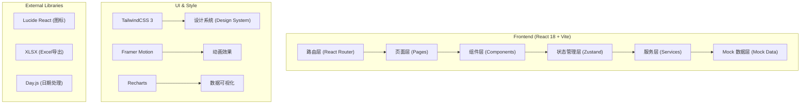
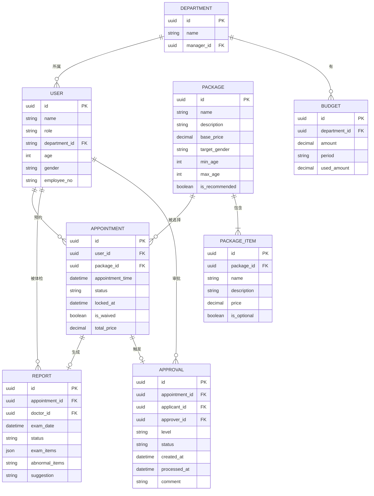

## 1. 架构设计



## 2. 技术选型

- **前端框架**：React 18 + TypeScript
- **构建工具**：Vite 5
- **样式方案**：TailwindCSS 3
- **路由管理**：React Router v6
- **状态管理**：Zustand（轻量级，适合多模块状态隔离）
- **数据可视化**：Recharts
- **动画库**：Framer Motion
- **图标库**：Lucide React
- **Excel导出**：SheetJS (xlsx)
- **日期处理**：Day.js
- **后端模拟**：MSW + TypeScript Mock 数据
- **代码规范**：ESLint + Prettier

## 3. 目录结构

```
src/
├── assets/              # 静态资源
├── components/          # 公共组件
│   ├── ui/             # 基础UI组件（Button, Card, Modal等）
│   ├── layout/         # 布局组件（Sidebar, Header等）
│   └── charts/         # 图表组件
├── pages/              # 页面组件
│   ├── Login/          # 登录页
│   ├── Dashboard/      # 首页大屏
│   ├── Appointment/    # 体检预约
│   ├── Report/         # 报告管理
│   ├── Approval/       # 费用审批
│   ├── Statistics/     # HR统计
│   └── Admin/          # 管理员中心
├── store/              # 状态管理
│   ├── useAuthStore.ts
│   ├── useAppointmentStore.ts
│   ├── useReportStore.ts
│   └── useApprovalStore.ts
├── services/           # API服务层
│   ├── auth.ts
│   ├── appointment.ts
│   ├── report.ts
│   └── admin.ts
├── mock/               # Mock数据
│   ├── data/
│   └── handlers.ts
├── types/              # TypeScript类型定义
│   ├── index.ts
│   ├── appointment.ts
│   ├── report.ts
│   └── user.ts
├── utils/              # 工具函数
│   ├── date.ts
│   ├── excel.ts
│   └── validator.ts
├── hooks/              # 自定义Hooks
│   ├── useCountdown.ts
│   ├── useRealtime.ts
│   └── usePermission.ts
├── routes/             # 路由配置
│   └── index.tsx
├── App.tsx
└── main.tsx
```

## 4. 路由定义

| 路由路径 | 页面名称 | 权限角色 | 说明 |
|---------|---------|---------|------|
| `/login` | 登录页 | 公开 | 身份认证入口 |
| `/` | 首页大屏 | 所有登录用户 | 实时数据概览，按角色展示不同数据 |
| `/appointment` | 体检预约 | 员工 | 套餐选择、时段预约 |
| `/appointment/history` | 预约历史 | 员工 | 查看历史预约记录 |
| `/report` | 我的报告 | 员工 | 查看体检报告 |
| `/report/entry` | 报告录入 | 医生 | 录入体检结果 |
| `/approval` | 费用审批 | HR/主管 | 审批费用申请 |
| `/statistics` | 统计报表 | HR/管理员 | 部门统计、报表导出 |
| `/admin/packages` | 套餐管理 | 管理员 | 套餐增删改查 |
| `/admin/rules` | 规则配置 | 管理员 | 系统规则设置 |
| `/admin/users` | 用户管理 | 管理员 | 用户权限管理 |

## 5. 核心数据模型

### 5.1 ER图



### 5.2 类型定义

```typescript
// 用户类型
type UserRole = 'employee' | 'doctor' | 'hr' | 'admin';

interface User {
  id: string;
  name: string;
  role: UserRole;
  departmentId: string;
  departmentName: string;
  age: number;
  gender: 'male' | 'female';
  employeeNo: string;
  avatar?: string;
}

// 体检套餐
interface PackageItem {
  id: string;
  name: string;
  description: string;
  price: number;
  isOptional: boolean;
  selected: boolean;
}

interface Package {
  id: string;
  name: string;
  description: string;
  basePrice: number;
  targetGender?: 'male' | 'female' | 'all';
  minAge?: number;
  maxAge?: number;
  isRecommended: boolean;
  items: PackageItem[];
}

// 预约
type AppointmentStatus = 'pending' | 'confirmed' | 'completed' | 'cancelled' | 'locked';

interface Appointment {
  id: string;
  userId: string;
  packageId: string;
  packageName: string;
  appointmentDate: string;
  appointmentTime: string;
  status: AppointmentStatus;
  lockedAt?: string;
  lockedExpireAt?: string;
  totalPrice: number;
  selectedItems: string[];
  isWaived: boolean;
  createdAt: string;
}

// 时段
interface TimeSlot {
  id: string;
  time: string;
  capacity: number;
  booked: number;
  available: number;
  doctorId?: string;
  doctorName?: string;
  isRecommended: boolean;
}

// 报告
type ReportStatus = 'draft' | 'submitted' | 'normal' | 'abnormal' | 'recheck_required';

interface ReportItem {
  name: string;
  value: string;
  unit?: string;
  referenceRange?: string;
  isAbnormal: boolean;
  abnormalType?: 'high' | 'low';
}

interface Report {
  id: string;
  appointmentId: string;
  userId: string;
  userName: string;
  doctorId: string;
  doctorName: string;
  examDate: string;
  status: ReportStatus;
  items: ReportItem[];
  abnormalItems: string[];
  suggestion: string;
  createdAt: string;
}

// 审批
type ApprovalStatus = 'pending' | 'approved' | 'rejected' | 'escalated';
type ApprovalLevel = 'supervisor' | 'hr_manager';

interface Approval {
  id: string;
  appointmentId: string;
  applicantId: string;
  applicantName: string;
  approverId: string;
  approverName: string;
  level: ApprovalLevel;
  status: ApprovalStatus;
  amount: number;
  budgetExceed: number;
  createdAt: string;
  processedAt?: string;
  comment?: string;
  escalated: boolean;
}

// 统计数据
interface DashboardStats {
  todayAppointments: number;
  todayCompleted: number;
  completionRate: number;
  abnormalReports: number;
  budgetUsed: number;
  budgetTotal: number;
  budgetProgress: number;
}

interface DepartmentStats {
  departmentId: string;
  departmentName: string;
  totalEmployees: number;
  completedCount: number;
  completionRate: number;
  pendingCount: number;
  notStartedCount: number;
}
```

## 6. 状态管理设计

### 6.1 认证状态
```typescript
interface AuthState {
  user: User | null;
  token: string | null;
  isAuthenticated: boolean;
  login: (username: string, password: string) => Promise<void>;
  logout: () => void;
  hasPermission: (roles: UserRole[]) => boolean;
}
```

### 6.2 预约状态
```typescript
interface AppointmentState {
  appointments: Appointment[];
  currentAppointment: Appointment | null;
  timeSlots: TimeSlot[];
  lockedSlot: TimeSlot | null;
  countdown: number;
  getRecommendedPackages: (user: User) => Package[];
  getTimeSlots: (date: string, packageId: string) => Promise<void>;
  lockSlot: (slot: TimeSlot) => void;
  confirmAppointment: (packageId: string, items: string[]) => Promise<void>;
  releaseSlot: () => void;
}
```

### 6.3 审批状态
```typescript
interface ApprovalState {
  approvals: Approval[];
  pendingCount: number;
  getApprovals: (status?: ApprovalStatus) => Approval[];
  processApproval: (id: string, approved: boolean, comment: string) => Promise<void>;
  checkEscalation: () => void;
}
```

## 7. 核心业务逻辑

### 7.1 智能套餐推荐
```typescript
function getRecommendedPackages(user: User, packages: Package[]): Package[] {
  return packages.filter(pkg => {
    const genderMatch = !pkg.targetGender || pkg.targetGender === 'all' || pkg.targetGender === user.gender;
    const ageMatch = (!pkg.minAge || user.age >= pkg.minAge) && (!pkg.maxAge || user.age <= pkg.maxAge);
    return genderMatch && ageMatch;
  }).sort((a, b) => (b.isRecommended ? 1 : 0) - (a.isRecommended ? 1 : 0));
}
```

### 7.2 时段智能推荐
```typescript
function recommendTimeSlots(slots: TimeSlot[], userPreference?: string): TimeSlot[] {
  return slots.map(slot => ({
    ...slot,
    isRecommended: slot.available > slot.capacity * 0.5 && 
                   parseInt(slot.time.split(':')[0]) >= 8 && 
                   parseInt(slot.time.split(':')[0]) <= 10
  })).sort((a, b) => {
    if (a.isRecommended && !b.isRecommended) return -1;
    if (!a.isRecommended && b.isRecommended) return 1;
    return b.available - a.available;
  });
}
```

### 7.3 费用计算与校验
```typescript
function calculateTotalPrice(pkg: Package, selectedItemIds: string[]): number {
  const baseItems = pkg.items.filter(item => !item.isOptional);
  const selectedOptional = pkg.items.filter(item => item.isOptional && selectedItemIds.includes(item.id));
  return [...baseItems, ...selectedOptional].reduce((sum, item) => sum + item.price, 0);
}

function validateBudget(totalPrice: number, departmentId: string): {
  withinBudget: boolean;
  exceedAmount: number;
  requiresApproval: boolean;
} {
  const budget = getDepartmentBudget(departmentId);
  const used = getUsedBudget(departmentId);
  const remaining = budget - used;
  const exceedAmount = totalPrice - remaining;
  
  return {
    withinBudget: exceedAmount <= 0,
    exceedAmount: Math.max(0, exceedAmount),
    requiresApproval: exceedAmount > 0
  };
}
```

### 7.4 报告自动校验
```typescript
function validateReport(report: Omit<Report, 'id' | 'createdAt'>): {
  valid: boolean;
  errors: string[];
  abnormalCount: number;
} {
  const errors: string[] = [];
  const requiredFields = ['doctorId', 'examDate', 'items'];
  
  requiredFields.forEach(field => {
    if (!report[field as keyof typeof report]) {
      errors.push(`缺少必填项: ${field}`);
    }
  });
  
  if (report.items.length === 0) {
    errors.push('体检项目不能为空');
  }
  
  const abnormalCount = report.items.filter(item => item.isAbnormal).length;
  
  if (abnormalCount > 0 && !report.suggestion) {
    errors.push('存在异常指标时必须填写建议');
  }
  
  return {
    valid: errors.length === 0,
    errors,
    abnormalCount
  };
}
```

## 8. 前端性能优化

1. **代码分割**：按路由进行代码分割，减少首屏加载时间
2. **虚拟滚动**：大数据列表使用虚拟滚动（HR统计页面）
3. **数据缓存**：使用 React Query 进行数据缓存与自动刷新
4. **防抖节流**：搜索、筛选输入使用防抖，滚动事件使用节流
5. **懒加载**：图表组件、图片使用懒加载
6. **记忆化**：使用 useMemo/useCallback 优化重渲染
7. **Bundle 优化**：使用 Vite 的 rollup 拆包策略，第三方库单独打包

## 9. 安全考虑

1. **路由守卫**：根据用户角色进行路由访问控制
2. **权限指令**：自定义 `usePermission` Hook 进行细粒度权限控制
3. **XSS 防护**：所有用户输入内容进行转义处理
4. **敏感数据**：报告数据传输加密，本地存储加密
5. **操作审计**：关键操作（审批、报告修改）记录操作日志
